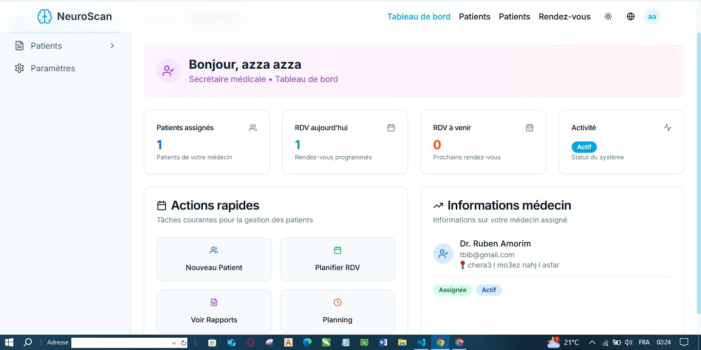
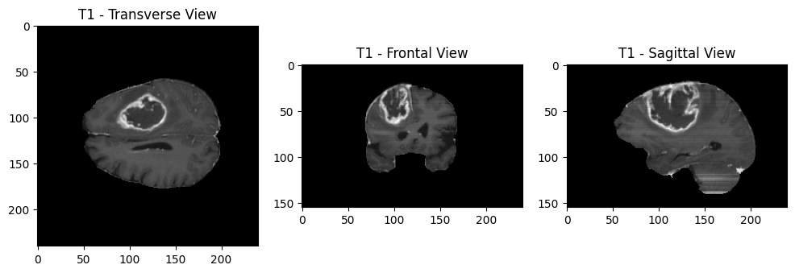
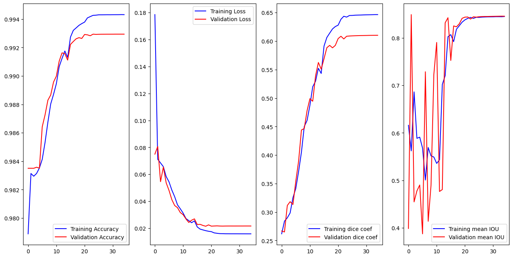

# 🧠 NeuroScan - Medical Management Interface for Brain Tumor Segmentation

<div align="center">


**Advanced AI-Powered Brain Tumor Segmentation Platform**

[](LICENSE)
[](https://www.python.org/downloads/)
[](https://reactjs.org/)
[](https://fastapi.tiangolo.com/)

*Developed by: Ahmed ELMABROUK, Azza CHELLY, Rahma BOUKHRIS*

</div>

---

## 📋 Table of Contents

- [Overview](#-overview)
- [Key Features](#-key-features)
- [Architecture](#-architecture)
- [Technologies](#-technologies)
- [Screenshots](#-Screenshots)
- [Installation](#-installation)
- [Usage](#-usage)
- [API Documentation](#-api-documentation)
- [Evaluation Metrics](#-evaluation-metrics)
- [Project Structure](#-project-structure)
- [Contributors](#-contributors)
- [License](#-license)

---

## 🎯 Overview

**NeuroScan** is an intelligent medical platform that integrates artificial intelligence with medical office management to revolutionize the diagnosis and monitoring of brain tumors. The system combines a U-Net-based automatic segmentation engine trained on the BraTS 2020 dataset with a comprehensive medical office management system.

### Motivations & Objectives

- **Reduce variability** and time required for manual brain tumor segmentation
- **Provide automated, accurate, and accessible tools** to assist radiologists in diagnosis and patient monitoring
- **Demonstrate the value of AI** in improving medical practices, particularly for complex brain pathologies

---

## ✨ Key Features

### 🤖 Advanced AI Segmentation

NeuroScan utilizes **U-Net architecture** for multi-class medical image segmentation:

- **Multi-modal analysis**: Processes 4 MRI modalities (T1, T1CE, T2, FLAIR)
- **3 tumor classes detection**:
  - 🔴 **Necrotic core** (class 1)
  - 🟢 **Peritumoral edema** (class 2)
  - 🔵 **Enhancing tumor** (class 3)

#### Quantitative Volumetric Analysis
- Absolute volume calculation in cm³
- Region-based analysis (labeling, masking, voxel counting)
- Mask refinement and percentage computation

#### MRI Data Optimization
- Modality selection (T1/T2 exclusion, FLAIR normalization, intensity rescaling on volumes)
- 2-channel optimization (FLAIR, T1CE)

#### Intelligent 3D Processing
- Axial slice extraction (50-150 / VOLUME_START_AT, VOLUME_SLICES)
- Batch redimensioning (Sequence) for efficient slice loading
- Conservation of pertinent slices

### 🏥 Medical Office Management

- **Secretary management**: Patient records and appointments
- **Patient monitoring**: Complete medical history tracking
- **Role-based dashboard**: Customized for each user role (Admin, Doctor, Secretary)

### 📊 MLOps & Model Monitoring

- **Performance tracking**: Accuracy, Dice coefficient, etc.
- **Minimalist versioning**: Model version management
- **Monitoring**: Real-time model performance tracking
- **Traceability**: Complete audit trail of predictions

---

## 🏗️ Architecture

### System Architecture

```
┌─────────────────────────────────────────────────────────────┐
│                     Frontend (React + Vite)                  │
│  ┌──────────────┐  ┌──────────────┐  ┌──────────────┐      │
│  │   Secretary  │  │    Doctor    │  │    Admin     │      │
│  │  Dashboard   │  │  Dashboard   │  │  Dashboard   │      │
│  └──────────────┘  └──────────────┘  └──────────────┘      │
└─────────────────────────────────────────────────────────────┘
                            │
                            ▼
┌─────────────────────────────────────────────────────────────┐
│                    Backend (FastAPI)                         │
│  ┌──────────────────────────────────────────────────────┐   │
│  │              RESTful API Endpoints                   │   │
│  │  • Authentication  • Patients  • Segmentation        │   │
│  │  • Appointments    • Reports   • MLOps               │   │
│  └──────────────────────────────────────────────────────┘   │
│                            │                                 │
│  ┌──────────────────────────────────────────────────────┐   │
│  │         AI Segmentation Engine (U-Net)               │   │
│  │  • Model Loading  • Preprocessing  • Inference       │   │
│  │  • Volume Analysis • Mask Generation                 │   │
│  └──────────────────────────────────────────────────────┘   │
└─────────────────────────────────────────────────────────────┘
                            │
                            ▼
┌─────────────────────────────────────────────────────────────┐
│              Database (SQLite/PostgreSQL)                    │
│  • Users  • Patients  • Images  • Segmentations             │
│  • Appointments  • Treatments  • Reports                     │
└─────────────────────────────────────────────────────────────┘
```

### Web Interface & Medical Management

- **Secretarial management**: Patient creation and appointment scheduling
- **Patient monitoring**: Complete medical record access
- **Role-based dashboards**: Customized views for each user type

---

## 🛠️ Technologies

### Frontend
- **React 18.3+** - Modern UI library
- **TypeScript** - Type-safe development
- **Vite** - Fast build tool
- **Tailwind CSS** - Utility-first styling
- **Shadcn/ui** - Component library
- **React Router** - Navigation
- **TanStack Query** - Data fetching
- **React Hook Form** - Form management
- **Recharts** - Data visualization

### Backend
- **FastAPI** - High-performance Python web framework
- **SQLAlchemy** - ORM with async support
- **Pydantic** - Data validation
- **JWT** - Secure authentication
- **TensorFlow 2.19** - Deep learning framework
- **U-Net Model** - Brain tumor segmentation

### AI/ML
- **U-Net Architecture** - Medical image segmentation
- **BraTS 2020 Dataset** - Training data
- **TensorFlow/Keras** - Model implementation
- **MLflow** - Experiment tracking
- **Custom Metrics**: Mean IoU, Dice coefficient, Precision, Sensitivity, Specificity

### Database
- **SQLite** - Development database
- **PostgreSQL** - Production-ready option


---
### Screenshots
Architecture Diagram
<div align="center">
  
</div>
Class Diagram
<div align="center">
  
</div>
Login Interface
<div align="center">
  
</div>
Admin Dashboard
<div align="center">
  
</div>
User Management
<div align="center">
  
</div>
Patient Information
<div align="center">
  
</div>
Medical Images Gallery
<div align="center">
  
</div>
Segmentation Gallery
<div align="center">
  
</div>
Segmentation Results
<div align="center">
  
</div>
3D Cross-Section View
<div align="center">
  
</div>
MLOps Dashboard
<div align="center">
  
</div>
Model Evaluation
<div align="center">
  
</div>
Model Comparison
<div align="center">
  
</div>
Dashboard Admin Overview
<div align="center">
  
</div>
---

## 📥 Installation

### Prerequisites

- **Python 3.10+**
- **Node.js 18+**
- **npm or yarn**
- **Git**

### Backend Setup

```bash
# Navigate to backend directory
cd backend

# Create virtual environment
python -m venv venv

# Activate virtual environment
# Windows:
venv\Scripts\activate
# Linux/Mac:
source venv/bin/activate

# Install dependencies
pip install -r requirements_cerebloom.txt

# Place your U-Net model
# Copy your trained model to: backend/models/my_model.h5

# Run the backend
python cerebloom_main.py
```

The backend will be available at `http://localhost:8000`

### Frontend Setup

```bash
# Install dependencies
npm install

# Start development server
npm run dev
```

The frontend will be available at `http://localhost:5173`

### Quick Start (Windows)

```bash
# Backend
cd backend
run_cerebloom.bat

# Frontend (in new terminal)
npm run dev
```

---

## 🚀 Usage

### Default Credentials

**Admin Account:**
- Email: `admin@cerebloom.com`
- Password: `admin123`

⚠️ **Change these credentials in production!**

### Workflow

1. **Login** with your credentials
2. **Secretary**: Create patient records and upload MRI images (T1, T1CE, T2, FLAIR)
3. **Doctor**: Launch AI segmentation on patient images
4. **System**: Automatic segmentation processing with U-Net model
5. **Doctor**: Review segmentation results and volumetric analysis
6. **Doctor**: Validate results and generate medical reports

---

## 📚 API Documentation

Once the backend is running, access the interactive API documentation:

- **Swagger UI**: `http://localhost:8000/docs`
- **ReDoc**: `http://localhost:8000/redoc`

### Key Endpoints

#### Authentication
- `POST /api/v1/auth/login` - User login
- `POST /api/v1/auth/refresh` - Refresh access token
- `GET /api/v1/auth/me` - Get current user info

#### Patients
- `POST /api/v1/patients` - Create new patient
- `GET /api/v1/patients/{id}` - Get patient details
- `PUT /api/v1/patients/{id}` - Update patient
- `GET /api/v1/patients` - List all patients

#### AI Segmentation
- `POST /api/v1/segmentation/create` - Create new segmentation
- `GET /api/v1/segmentation/status/{id}` - Check segmentation status
- `GET /api/v1/segmentation/segments/{id}` - Get tumor segments
- `POST /api/v1/segmentation/validate/{id}` - Validate segmentation

#### Medical Images
- `POST /api/v1/images/upload` - Upload MRI image
- `POST /api/v1/images/series` - Create image series
- `GET /api/v1/images/patient/{id}` - Get patient images

---

## 📊 Evaluation Metrics

The segmentation model is evaluated using:

- **Mean IoU** - Intersection over Union
- **Dice Coefficient (Global)** - Overall segmentation accuracy
- **Precision** - Positive predictive value
- **Sensitivity** - True positive rate
- **Specificity** - True negative rate
- **Dice Coefficient per Class**:
  - Necrotic core (class 1)
  - Peritumoral edema (class 2)
  - Enhancing tumor (class 3)

---

## 📁 Project Structure

```
NeuroScan/
├── backend/
│   ├── models/              # AI models
│   │   └── my_model.h5      # U-Net trained model
│   ├── routers/             # API route handlers
│   ├── services/            # Business logic
│   ├── config/              # Configuration files
│   ├── utils/               # Utility functions
│   ├── uploads/             # Uploaded medical images
│   ├── api_results/         # Segmentation results
│   └── cerebloom_main.py    # Main backend entry point
├── src/
│   ├── components/          # React components
│   ├── pages/               # Page components
│   ├── services/            # API services
│   ├── contexts/            # React contexts
│   └── utils/               # Frontend utilities
├── public/                  # Static assets
├── package.json             # Frontend dependencies
└── README.md               # This file
```

---

## 👥 Contributors

This project was developed as part of a PFA (Projet de Fin d'Année) at:

**North American University Co. - SFAX TUNISIA**
  
**Institutions:**
- IIT - Institut International de Technologie


---

## 📄 License

This project is licensed under the MIT License - see the [LICENSE](LICENSE) file for details.

---

## 🙏 Acknowledgments

- **BraTS 2020** dataset for training data
- **U-Net** architecture for medical image segmentation
- All contributors and supporters of this project


